# Vraag 1: welke vliegtuigmaatschappij is gemiddeld de goedkoopste/duurste?

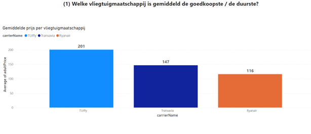

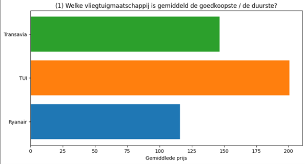

# Vraag 2: Hoe vaak vliegt elke vliegtuigmaatschappij naar elk van de bestemmingen?

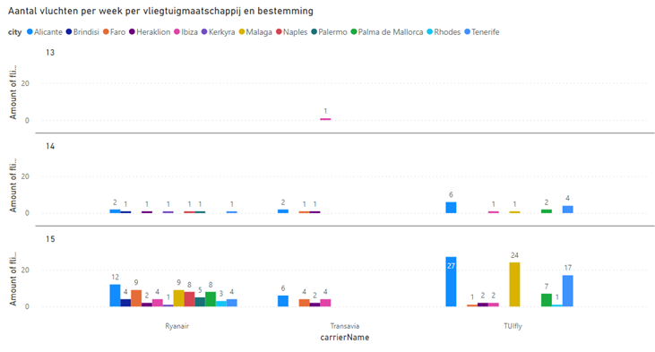

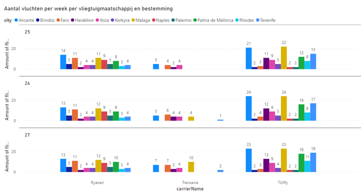

# Vraag 3: Welke vliegtuigmaatschappij biedt de snelste vlucht aan naar een bepaalde bestemming?  

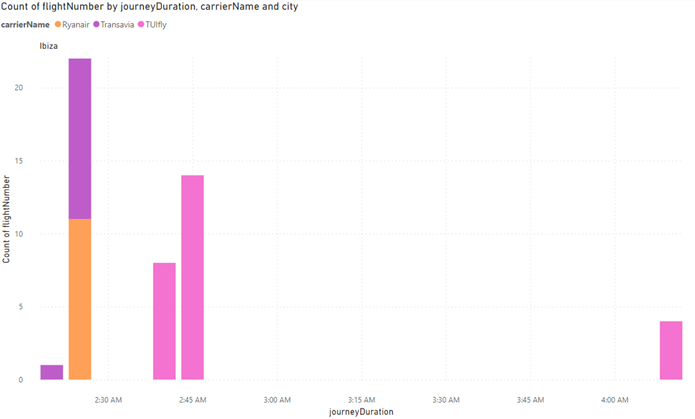

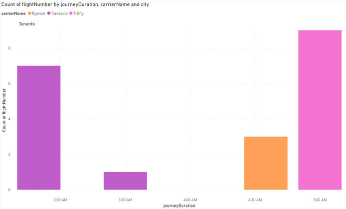

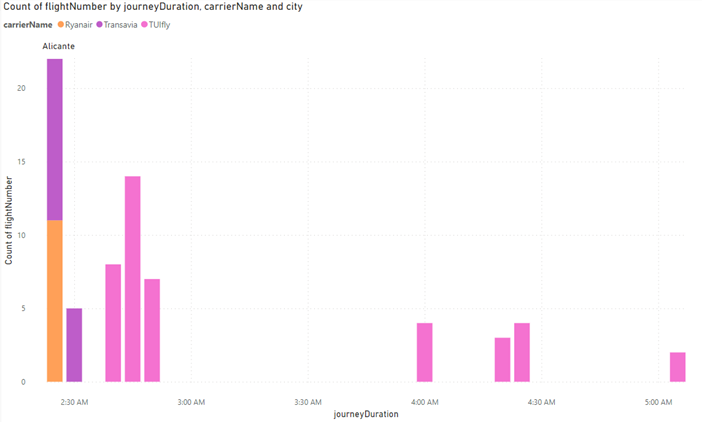

# Vraag 4: Welke vliegtuigmaatschappij biedt de goedkoopste vlucht aan naar een bepaalde bestemming?

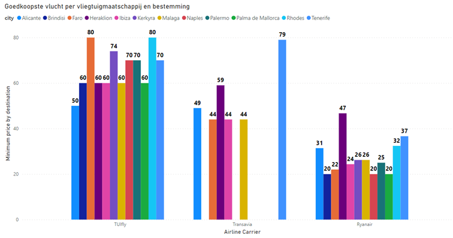

# Vraag 5: Welke vliegtuigmaatschappij biedt een vlucht aan zonder tussenstops, met maximum 1?

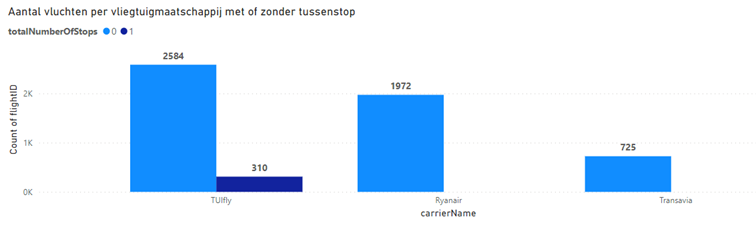

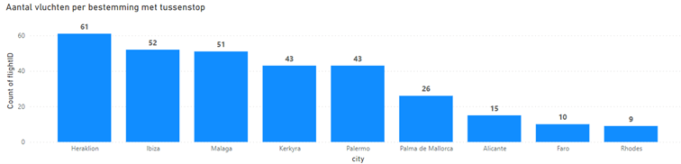

# Vraag 6: Rapport over prijsevolutie en beschikbaarheidsevolutie doorheen de tijd (Beperkt tot Alicante en 21 april 2023)

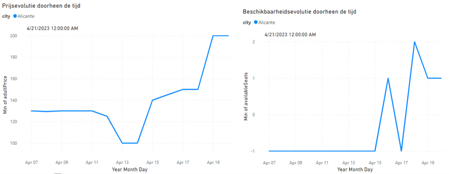

# Vraag 7: Is er een correlatie met de vakantiebestemmingen: zijn bepaalde bestemmingen significant duurder dan andere bestemmingen?

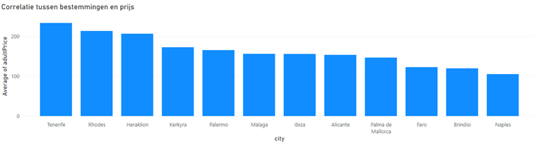

# Vraag 8: Zijn de prijzen gerelateerd aan vakantieperiodes (hier in België)?

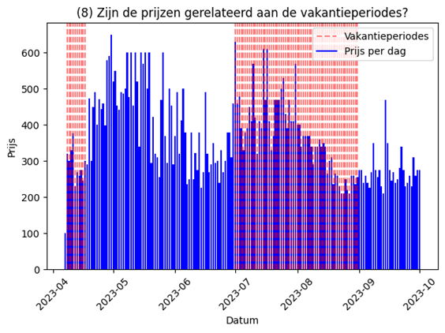

# Vraag 9: Kan je de prijsstrategie afleiden? (Invloed van aantal dagen voor vertrek, invloed van beschikbaarheid)

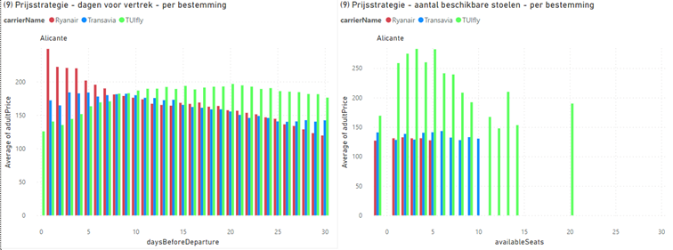

### Voorbeeld analyse in pandas Ryanair naar alicante: 
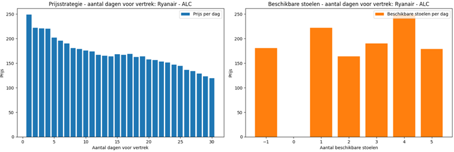

# Vraag 10: Is er een link tussen prijs en afstand (en duration)? Bijvoorbeeld Tenerife is anderhalf uur verder dan Alicante.

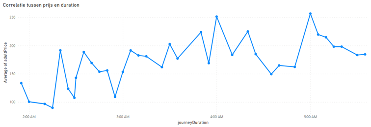

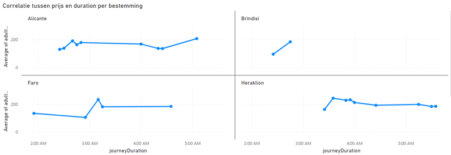

# Vraag 11: Is er een link tussen prijs en land? Zijn sommige landen opvallend duurder (en kan dit niet verklaard worden door de extra afstand)?

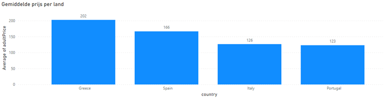

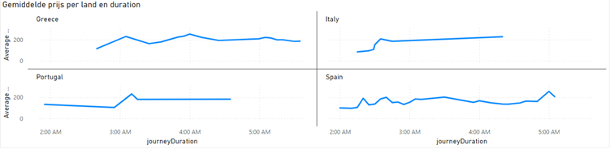

# Vraag 12: Hoeveel dagen voor vertrek is een vlucht volgeboekt? Zijn er bestemmingen waarbij de vluchten bijna volgeboekt zijn?

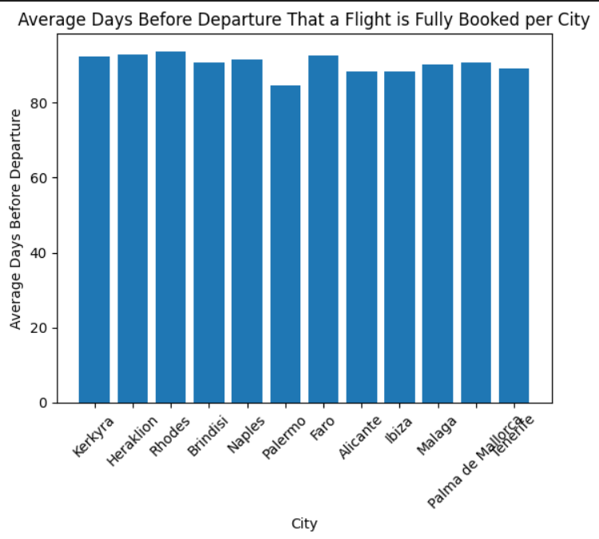

```
Om deze vraag te beantwoorden, hebben we eerst alle rijen uit de tabel ‘factFlights’ geselecteerd waarbij er geen beschikbare plaatsen meer waren. Vervolgens hebben we deze rijen gegroepeerd op vluchtnummer en hebben we alleen de eerste datum genomen die voorkomt.
Daarna hebben we berekend hoeveel dagen er nog over zijn tot aan de vertrekdatum. Bij deze stap hebben we voor elke bestemming het gemiddeld aantal dagen tot de vertrekdatum berekend en vervolgens een staafdiagram van gemaakt.
```


# Vraag 13: Hoeveel procent van de vluchten zijn volgeboekt? / Hoeveel plaatsen zijn er nog vrij 5 dagen voor vertrek?

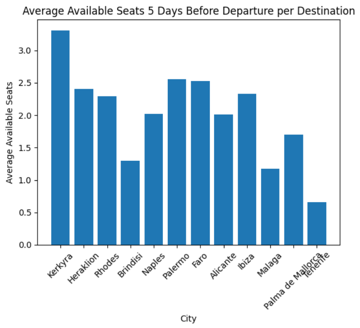

```
Het doel van deze grafiek is om de bestemming te identificeren waar je de meeste kans hebt om last-minute een ticket te bemachtigen.
Om dit te bereiken, hebben we eerst alle rijen uit de tabel ‘factFlights’ geselecteerd waarbij de scrape datum vijf dagen voor de vertrekdatum lag. Vervolgens hebben we deze rijen gegroepeerd op bestemming en het gemiddelde aantal beschikbare plaatsen berekend.
Met behulp van deze gegevens hebben we een staafdiagram gemaakt om de resultaten visueel weer te geven.

```

# Vraag 14a: Plot het verband tussen de prijs en het aantal dagen voor vertrek voor Ryanair voor de afgelopen maand.

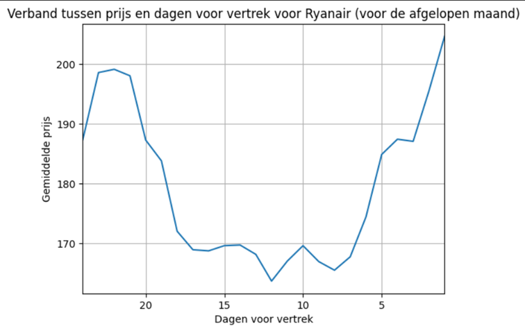

```
Het doel van deze grafiek is om het optimale moment voor het boeken van een Ryanair-vlucht te bepalen 30 dagen voor vertrek. 

Om dit te bereiken, beginnen we met het selecteren van alle rijen uit de tabel 'factFlights' waarbij de maatschappij Ryanair is en de scrape datum binnen 30 dagen voor de vertrekdatum van de vlucht valt. 

Vervolgens groeperen we deze rijen op basis van het aantal dagen voor vertrek, waardoor we 30 groepen krijgen, en berekenen we het gemiddelde van de prijzen. 

Met behulp van deze gegevens stellen we een grafiek op om de informatie visueel weer te geven. 
```

# Vraag 14b:  Maak gebruik van regressie om de prijzen te voorspellen voor de volgende maand.

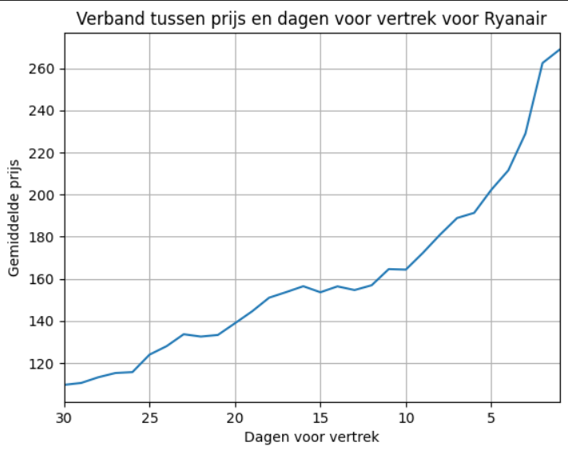

```
Het doel van deze grafiek is om een voorspelling te maken van de prijs per aantal dagen voor vertrek voor de komende maand. 

Het model dat we hebben getraind, vertoont echter underfitting omdat we een lineair model gebruiken. De relatie tussen de waarden is echter niet 100% lineair, en dus bevat het model onvoldoende complexiteit. Hierdoor behalen we slechts een nauwkeurigheidsscore van 54,3%. Dit wordt duidelijk zichtbaar wanneer je de bovenstaande grafiek vergelijkt met de grafiek van vraag 14a, waarbij de laatste meer de vorm heeft van een parabool, terwijl de voorspelde grafiek eerder een rechte lijn volgt. 
```

# Vraag 15: In PowerBI een kaart maken met de mogelijke bestemmingen als de prijs in een bepaalde range moet liggen + op een bepaald moment?

### Algemeen:
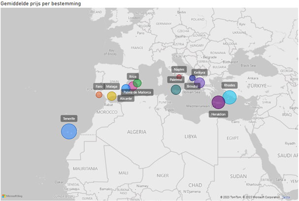

### Met slicers (tweede week paasvakantie tussen 19.99 en 60 euro):
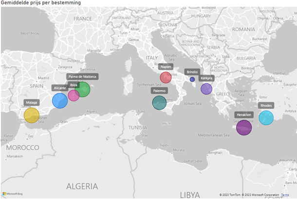

# Vraag 16: Welke vliegtuigmaatschappij biedt de meeste directe vluchten aan naar een specifieke bestemming?

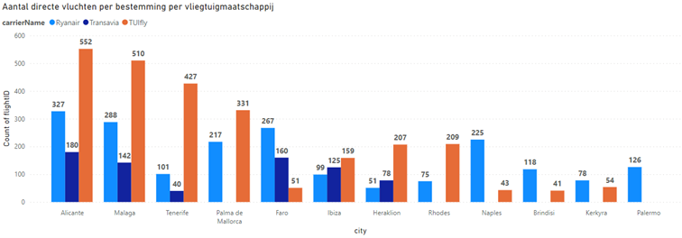

# Vraag 17: Welke luchthavens hebben de hoogste gemiddelde ticketprijzen voor specifieke bestemmingen?

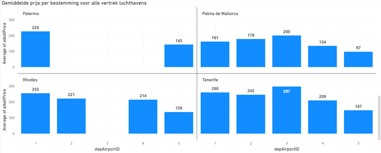

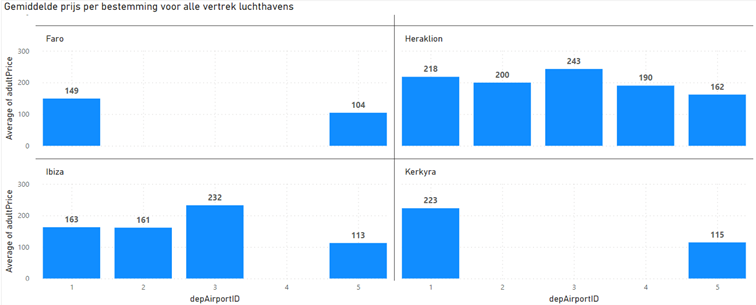

# Vraag 18: Welke bestemmingen hebben de grootste vraag naar vluchten en zijn daarom het meest gevoelig voor prijsschommelingen?

### Alicante:
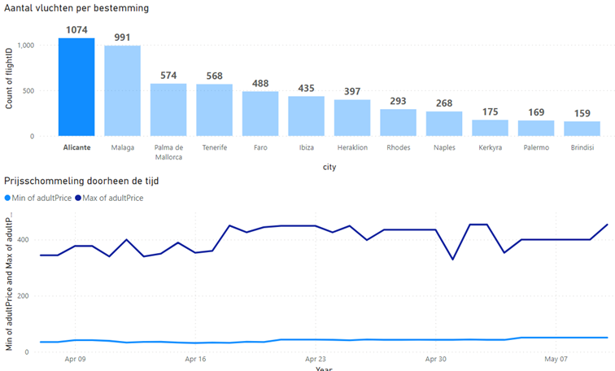

### Palermo:
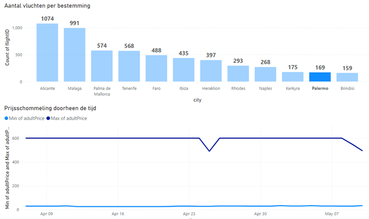

# Vraag 19: Welke dag van de week zijn de prijzen, per bestemming, gemiddeld het laagst?

### Algemeen:
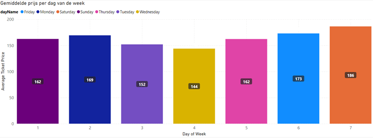

### Napels:
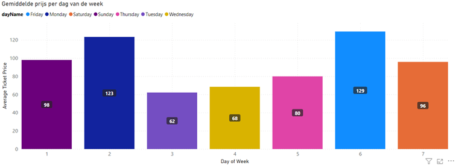

### Tenerife:
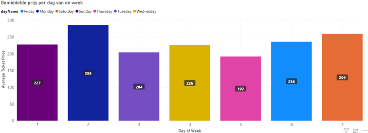

# Vraag 20: Wat is het goedkoopste vertrekuur voor vluchten?

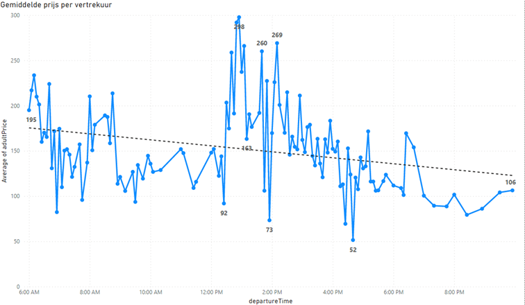